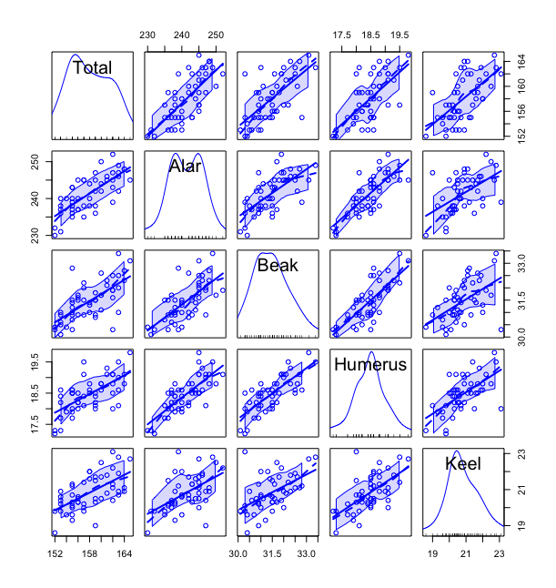

```{r setup, include=FALSE}
knitr::opts_chunk$set(echo = TRUE)
```

## HW 2

**FOR EVERY PLOT BELOW, MAKE A BRIEF COMMENT AS TO WHAT YOU SEE IN THE DATA.**

### Problem One

Bumpus Sparrow Data (see p. 2 of book):
 
Body measurements of female sparrows: X1=total length, X2=alar length, X3=length of beak and head, X4=length of humerus, X5=length of keel and sternum; all in mm). Birds 1 to 21 survived a severe storm near Brown University in Rhode Island while the remainder died. (Original source Bumpus 1898.)

```{r}
text <- textConnection(
"ID X1 X2 X3 X4 X5
01 156 245 31.6 18.5 20.5 
02 154 240 30.4 17.9 19.6 
03 153 240 31.0 18.4 20.6 
04 153 236 30.9 17.7 20.2 
05 155 243 31.5 18.6 20.3 
06 163 247 32.0 19.0 20.9 
07 157 238 30.9 18.4 20.2 
08 155 239 32.8 18.6 21.2 
09 164 248 32.7 19.1 21.1 
10 158 238 31.0 18.8 22.0 
11 158 240 31.3 18.6 22.0 
12 160 244 31.1 18.6 20.5 
13 161 246 32.3 19.3 21.8 
14 157 245 32.0 19.1 20.0
15 157 235 31.5 18.1 19.8 
16 156 237 30.9 18.0 20.3 
17 158 244 31.4 18.5 21.6 
18 153 238 30.5 18.2 20.9 
19 155 236 30.3 18.5 20.1 
20 163 246 32.5 18.6 21.9 
21 159 236 31.5 18.0 21.5 
22 155 240 31.4 18.0 20.7 
23 156 240 31.5 18.2 20.6 
24 160 242 32.6 18.8 21.7 
25 152 232 30.3 17.2 19.8 
26 160 250 31.7 18.8 22.5 
27 155 237 31.0 18.5 20.0 
28 157 245 32.2 19.5 21.4 
29 165 245 33.1 19.8 22.7 
30 153 231 30.1 17.3 19.8 
31 162 239 30.3 18.0 23.1 
32 162 243 31.6 18.8 21.3 
33 159 245 31.8 18.5 21.7 
34 159 247 30.9 18.1 19.0 
35 155 243 30.9 18.5 21.3 
36 162 252 31.9 19.1 22.2
37 152 230 30.4 17.3 18.6
38 159 242 30.8 18.2 20.5
39 155 238 31.2 17.9 19.3
40 163 249 33.4 19.5 22.8
41 163 242 31.0 18.1 20.7
42 156 237 31.7 18.2 20.3
43 159 238 31.5 18.4 20.3
44 161 245 32.1 19.1 20.8
45 155 235 30.7 17.7 19.6
46 162 247 31.9 19.1 20.4
47 153 237 30.6 18.6 20.4
48 162 245 32.5 18.5 21.1
49 164 248 32.3 18.8 20.9")
dat <- read.delim(text, header=TRUE, sep="")
colnames(dat) <- c("LineNum", "Total", "Alar", "Beak", "Humerus", "Keel")
class(dat); dim(dat)
head(dat)
```


The code above should give you the sparrow data as a dataframe.  (In the following, you probably don't want to include the first variable LineNum.)

Make the following plots:

a) 3-D plot of X1, X2, X3
(scatterplot3d, scatter3d are example functions).

$\textbf{Solution:}$
```{r,eval=FALSE}
scatter3d(dat$Total, dat$Alar, dat$Beak, surface = FALSE)
```
The interactive 3d plot lets us clearly see the relationship between the 3 variables. We can see 
that as Beak increases there is a slight increasing rrend in Alar and Total. As Alar decreases we see a 
decreasing trend in total. A good tip for seeing these trends involves pointing the axis you want to keep constant
perpendicular to the screen. 


b) All variables plotted against each other as a pairs plot of some kind.

$\textbf{Solution:}$
```{r,eval=FALSE}
scatterplotMatrix(dat[,c(2:6)])
```
Generally we can see that the total increases with respect to all other variables. However generally 
these relationships look to have relatively large variances. There are clear relationships between Beak and Humerus
as the plot looks to have low variance and exhibits a clear trend. Similarly we can see that relationship between Humerus and Alar.
```{r, echo=FALSE, fig.cap="Scatterplot Matrix",fig.align="center",  out.width = '75%'}

```


c) Use summary to describe each variable, i.e. summary(X1)

$\textbf{Solution:}$
```{r,eval=TRUE}
summary(dat[,c(2:6)])
```


d) Get the covariance and correlation matrices: What do these tell you? Do they agree with what you see in the earlier plots?

$\textbf{Solution:}$
```{r,eval=TRUE}
cor(dat[,c(2:6)])
cov(dat[,c(2:6)])
```
These matrices quantify the spread of the data in each of the plots from the scatter plot matrix, as well as the strength of the trend. 
The values where we saw a strong correlation coincide to those where we saw the clearest trend, and the values where we see low varicance coincide with close grouping of the data. 


e) In the library ‘aplpack’ (you need to install this one with install.packages("aplpack")) you
can get Chernof Faces, then make Chernov Faces of all of the sparrow data.

$\textbf{Solution:}$
```{r,eval=FALSE}
faces(dat[,c(2:6)])
```
```{r, echo=FALSE, fig.cap="Chernov Faces",fig.align="center",  out.width = '50%'}

```
There seems go be a lot of obsevarions with red faces, and of those they mostly all have green hair. Of the observations 
with square and yellow faces there seems to be a prevailing hair style. I have a really difficult time reading this visualization. 


f) Now make a star plot. Don't forget to describe any interesting 
features you see in the data, based on the plots.

$\textbf{Solution:}$
```{r,eval=FALSE}
stars(dat[,c(2:6)])
```
```{r, echo=FALSE, fig.cap="Star Plot",fig.align="center",  out.width = '50%'}

```
I find the star plot a lot easier to read. We can clearly see a few super small outliers that look like dots in the visualization. There does seem to be a trend in the data where the stars aim towards the top left. 


g) Go to the Multivariate Task View (http://cran.r_project.org/ then click Task Views, then Multivariate) and find a function not described above that makes plots. Try it out for fun!

$\textbf{Solution:}$
```{r,eval=FALSE}
install.packages('ellipse')
plotcorr(cor(dat[,c(2:6)]))
```
```{r, echo=FALSE, fig.cap="Star Plot",fig.align="center",  out.width = '75%'}

```
This plot visualizes the correlation matrix using the semi-axis of an ellipse. We can see that the direction of the ellipses
reflects the positive correltions we saw in the previous correlation matrix. 


h) Regress X1 on X2. Does the result agree (qualitatively) with what you have seen above?

$\textbf{Solution:}$
```{r, eval=TRUE}
out <- lm(dat$Total ~ dat$Alar)
summary(out)
```
From the summary output we can see that the intercept for the linear regression is  0.52996 which describes the positive relationship that we saw before. The high significance and low standard error also describe what we saw form the covariance and 
correlation matrices. 


#### Problem Two

Note that if $X$ is a matrix, you can get the column means with $(1/n){\bf 1'X}$ and the covariance matrix with $(X - (1/n){\bf 11'X})'(X - (1/n){\bf 11'X})$.  Using the code below, compute these matrices, then annotate the code to tell me what it is doing.  Compare the result to R functions that compute the column means and the covariance matrix.  Finally, for the covariance matrix, use an R function to find all of the eigenvalues.  Is this matrix positive definite?  How can you tell?

$\textbf{Solution:}$
```{r, eval=TRUE}
## Turn our data frame into a matrix object
X <- as.matrix(dat[,2:6])
## Initialize an identity vector
one <- matrix(ncol=1, rep(1,49))
## Computing Column means
invisible((1/49)*t(one)%*%X)
## Centering our data by their column means
XC <-  X - (1/49)*one%*%t(one)%*%X
## Computing covariance matrix
covar <- (1/(49-1))*t(XC)%*%XC
```
Here are the column means, 
```{r, eval=TRUE}
(1/49)*t(one)%*%X
```
Here is the covariance matrix, 
```{r, eval=TRUE}
(1/(49-1))*t(XC)%*%XC
```

Here is the computation for the column means using the colMeans function, 
```{r, eval=TRUE}
colMeans(dat[,2:6])
```

Here is the covariance matrix using the cov function, 
```{r, eval=TRUE}
cov(dat[,2:6])
```
We can see that the functions and our matrix calcuations give the same result.
Using the eigen function we can compute the eigenvalues and eigenvectors for the covar 
matrix, 
```{r, eval=TRUE}
eigen(covar)
```
We know that the covariance matrix is positive definite because all of it's eigenvalues are positive. 


#### Problem Three

Two groups of southern Australian bottlenose dolphins from two areas (Gippsland Lakes and Port Phillip Bay) were compared using stable isotope measurements from museum specimens (delta13C and delta15N).

(K. Owen, Charlton-Robb, R. Thompson (2011) **Resolving the Trophic Relations of Cryptic Species: An Example Using Stable Isotope Analysis of Dolphin Teeth.** *PLoS One* 6(2): e16457. doi:10.1371/journal.pone.0016457.)

```{r, fig.height=4, fig.width=4}
Gipperton <- structure(c(-14.3, -13.2, -14.5, -15.8, -15.4, -15.3, -15.2, 
-14.9, 15.2, 15.2, 15.6, 16, 15.2, 15.8, 14.6, 14.3), .Dim = c(8L, 
2L), .Dimnames = list(NULL, c("C", "N")))
PortPhillip <- structure(c(-13.4, -13.8, -13.8, -15.1, -15, -13.4, 15.5, 14.6, 
18.5, 18.6, 17.8, 17), .Dim = c(6L, 2L), .Dimnames = list(NULL, 
    c("C2", "N2")))
#
#
Gipperton
PortPhillip
plot(Gipperton, pch=19, col=1, xlim=c(-16,-12), ylim=c(13,19))
points(PortPhillip, pch=19, col=2)
```

a)  Compute a vector of column means for each dataset, and compute the covariance matrix for each dataset.  You can use higher-level functions such as rowMeans() and cov(), you don't have to use the matrix definitions.

$\textbf{Solution:}$
```{r, eval=TRUE}
GippertonMeans <- colMeans(Gipperton)
PortPhillipMeans <- colMeans(PortPhillip)

covarGipperton <- cov(Gipperton)
covarPortPhillip <- cov(PortPhillip)
```

b)  Write the null and alternative hypothesis of a test that checks for a difference in means between the two groups.

$\textbf{Solution:}$
The null hypothesis would be that the means for each group of data Gipperton and PortPhilllip are the same. The alternative hypothesis would be that there exists a pair that are not the same. 


c) What are the assumptions of the Hotelling's $T^2$ test?

$\textbf{Solution:}$
The assumptions for are that each group of observarions with $p$ variables has independent observarions with a multivariate normal distribution and the same covariance matrix. 


d) From the class notes, compute the Hotelling's $T^2$ statistic.

$\textbf{Solution:}$
Recall from the class notes that the fomrula for computing Hotelling's $T^2$ statistic is, 
$$
T2 = (\hat{x}_1 - \hat{x}_2)'\Sigma_{pooled}^{-1}(\hat{x}_1 - \hat{x}_2)\dfrac{n_1n_2}{n_1 + n_2}
$$
We can compute this by hand in R by using the computations form the previous problem. Doing so we get the following, 
```{r, eval=TRUE}
covarPooled <- ((8-1)*covarGipperton + (6-1)*covarPortPhillip)/((6 + 8)-2)
(GippertonMeans - PortPhillipMeans)%*%solve(covarPooled)%*%(GippertonMeans - PortPhillipMeans)*((8*6)/14)
```

e) Finally, compute the p-value of the test.  What is your conclusion at the 0.05 significance level?

$\textbf{Solution:}$
We can compute the p-value of the $T^2$ statistic by converting it to an F statistic, then pulling the p-value from the f distribution, 

$$
F = \dfrac{(n - 1 - p)T^2}{(n - 2)p}
$$
Doing so in R we get the following, 
```{r, eval=TRUE}
T <- (GippertonMeans - PortPhillipMeans)%*%solve(covarPooled)%*%(GippertonMeans - PortPhillipMeans)*((8*6)/14)
F <- T*(14-2-1)/((14-2)*2)
pf(F, df1=2, df2=11, lower.tail=FALSE)
```

f)  Now find a Hotelling's test function in some R package.  Run this and see if the results are the same.

$\textbf{Solution:}$
```{r, eval=TRUE}
library(Hotelling)
hotelling.test(Gipperton,PortPhillip)$pval
```

g)  Don't do more in this homework, but, in general, if we reject the null hypothesis in the Hotelling's T2 test, what would you look at next?

$\textbf{Solution:}$
When we reject the null hypothesis the test tells us that there exists at least one pair of $\mu_i$ that are statistically different. The next step would be look through the data and trying to find the difference. 


#### Problem Four

If the data does not look very close to normal, we might want to replace the Hotelling's T2 test with a randomization test.  I'll show the code that does this:

```{r, eval=FALSE}
library(Hotelling)
#
#  Get T2 statistic from original data
#
T2 <- hotelling.stat(Gipperton, PortPhillip)$statistic
T2
#
# Combine the data
#
X_comb <- rbind(Gipperton, PortPhillip)
#
#  Randomly split them into two groups of size 6 and 8, then compute stat
#
randomized_T2 <- rep(NA,2000)  # 2000 values to be simulated
for(i in 1:2000){
  sample_row_index <- sample(1:14, size=6, replace=FALSE)
  X1_temp <- X_comb[sample_row_index,]  # Sample 6 rows for X1_temp
  X2_temp <- X_comb[-sample_row_index,] # Put the rest in X2_temp
  randomized_T2[i] <- hotelling.stat(X1_temp, X2_temp)$statistic
}
hist(randomized_T2, n=30)
mean(randomized_T2 > T2)
```

Run the code above.  Based on how I described a randomization test in class, at the 0.05 significance level, do you reject the null hypothesis that the mean delta C and delta N are the same in the two populations?

If you have not done many randomization tests, you might want to carefully look through the code and see how it works.

$\textbf{Solution:}$
The point of the randomized test is to get around the assumption of multivariate normality i.e the groups exhibit similar variablity but we don't trust that they are both distriubuted noramlly. This assumption is needed when we approximate the T^2 distribution with an F distribution. To get around it we bootsrap the T^2 values by randomizing the observations in each group, then we compute a 'p-value' from that distributino of T^2 values. Here, at a significance level of  0.05 we would reject the null hypothesis since the estimated p-value is $\sim$ 0.01.


